# MRFEA Negative Ion Analysis Tool

[](https://github.com/richardlitt/standard-readme)

Data processing and diagnostic analysis pipeline for current-voltage (I-V) measurements performed with the Magnetized Retarding Field Energy Analyzer (MRFEA) in low-pressure deuterium plasmas.

## Table of Contents

- [State Of The Art](#state-of-the-art)
- [Install](#install)
- [Project Layout](#project-layout)
- [Sample Data](#sample-data)
- [Usage](#usage)
- [Configuration](#configuration)
- [Examples](#examples)
- [Modules](#modules)

## State Of The Art

In low-pressure hydrogen/deuterium plasmas, surface-produced negative ions (NI) are generated when positive ions (H+/D+) or neutrals interact with a negatively biased sample surface (V_bias), stripping one or two electrons. These NI are accelerated across the plasma sheath towards the diagnostic tool.

The Magnetized Retarding Field Energy Analyzer (MRFEA) isolates NI by employing a localized rectangular magnetic barrier (B ≈ 450 G). Due to their small Larmor radius, plasma electrons are strongly magnetized and suppressed by the barrier. Conversely, NI possess a significantly larger Larmor radius, traversing the magnetic barrier to reach the collector across both positive and negative collector bias regimes. Positive ions (PI), having the same mass as NI, reach only the negative collector as they are repelled at the positive side.

This software pipeline processes raw MRFEA collector current-voltage characteristics by comparing biased (sample biased at -60 V) and unbiased (sample kept at ground) acquisitions:

* **Unbiased Acquisition**, I_u, is the current measured when the sample is grounded. Some of these characteristics are plotted in **Fig. 3** left.
* **Biased Acquisition**, I_b, is the current measured when the sample is negatively biased. **Fig. 3** right shows some of these sweeps when the sample bias was -60 V.

On top of the PI current, negative by convention, one can notice the NI contribution when biased and unbiased characteristics are plotted side by side. Therefore, this software aims to extract the NI current from the PI background by the simple subtraction:

$$I_{ni} = I_b - I_u$$

The voltage derivative of the NI current yields the Negative Ion Energy Distribution Function (NIEDF). The computation is implemented using Savitzky-Golay numerical filtering.

Experimentally, it turns out that there is a difference of approximately 10 nA between the biased and the unbiased PI baseline. As a result, the subtraction above cannot be performed directly. However, this software estimates the correct zero-negative-ion baseline with two reconstruction methods, described briefly here:

* **Shift Method:** Applies a constant vertical offset to the unbiased curve over a configured voltage range [V_min, V_max].
* **Scale Method:** Reconstructs the baseline by multiplying the unbiased curve by the average ratio calculated over the range [V_scaling_min, V_scaling_max]:

$$\frac{I_{\text{biased}}}{I_{\text{unbiased}}}$$
  
MRFEA acquisitions are sensitive to plasma instabilities. To assess the statistical variability of the experimental measurements, this software evaluates the dispersion distributions using Gaussian fits (μ, σ, χ²/ndof) across collector biases.

NI production is related to the PI flux impinging on the sample surface. The code estimates the PI flux from the Bohm criterion as

  <a name="eq-piflux"></a>
  $$\Phi_{PI} = 0.6\, n_e \sqrt{T_e c^2 / M_i} \qquad \text{(1)}$$

  where n_e and T_e are the Langmuir-probe electron density and temperature (`ELECTRON_DENSITIES`, `ELECTRON_TEMPERATURES`) and M_i is the ion mass (`ION_MASS`).

NI production is also sensitive to pressure: at higher pressure, collisional detachment losses via

$$H^- + H_2 \rightarrow H + H_2 + e^-$$

become more likely. Hence, this code corrects the -40V negative ion current over the MRFEA collector distance d (`DISTANCE`) as

$$I_{\text{corr}} = I \cdot e^{d/\lambda}, \qquad \lambda = \frac{1}{n_{\text{gas}}\,\sigma}, \qquad n_{\text{gas}} = \frac{p}{k_B T_{\text{gas}}}$$

with σ the detachment cross section (`CROSS_SECTION`, `GAS_TEMPERATURE`, `BOLTZMANN`), and plots the corrected current against the PI flux.

## Install

Clone the repository:

```sh
git clone git@github.com:Forex98/mrfea-analysis-tool.git
cd mrfea-analysis-tool
```

This project requires **Python 3.8+** and standard scientific libraries.

Install all dependencies via `pip`:

```sh
pip install numpy matplotlib scipy gdown
```

## Project Layout

```
alenicosw/
├── main.py                 # entry point — run this
├── config.txt
├── Doxyfile
├── modules/                # library code (importable package)
│   ├── configreader.py
│   ├── dataloader.py
│   ├── downloader.py
│   ├── functions.py
│   ├── standardmethod.py
│   └── style.py
├── measurements/           # put every dataset to analyse in here
│   └── <condition-name>/{unbiased,biased}/
└── results/                # created automatically, always separate from measurements/
    ├── <condition-name>/   # per-dataset plots, one subfolder per analysed condition
    └── comparisons/        # the 4 aggregate comparison plots
```

`measurements/` and `results/` are created/populated as needed — you only ever need to create `measurements/` and place your data folders inside it. The name of both folders can be changed via `MEASUREMENTS_FOLDER`/`RESULTS_FOLDER` in `config.txt` (see [Configuration](#configuration)).

## Sample Data

Don't have your own MRFEA acquisitions yet? Two ready-to-use datasets are available for testing the full pipeline, including the comparison mode:

| Scan type | Control parameter | Google Drive link |
| :--- | :--- | :--- |
| Pressure scan | `PRESSURES` | https://drive.google.com/drive/folders/11DwjXjeiXeNJIPMTSH12uOGSi7H4B6j8?usp=drive_link |
| Power scan | `POWERS` | https://drive.google.com/drive/folders/1t2s-ii6JlqrwDrMq75_Y7C-gfdUquRzF?usp=drive_link |

To use one of them, either:
- **let the tool download it automatically** — set `DATA_DRIVE_URL` in `config.txt` to the chosen link and run `python main.py` with no local dataset folders in place (see [Fetching data automatically from Google Drive](#fetching-data-automatically-from-google-drive)); or
- **download it manually** from the link and extract it into `measurements/`, then run `python main.py` as usual.

Only four keys need to change to switch between the two sample scenarios — everything else in `config.txt` stays the same:

| Key | Power scan sample | Pressure scan sample |
| :--- | :--- | :--- |
| `DATA_DRIVE_URL` | `.../folders/1t2s-ii6JlqrwDrMq75_Y7C-gfdUquRzF` | `.../folders/11DwjXjeiXeNJIPMTSH12uOGSi7H4B6j8` |
| `POWERS` | `[200, 300, 400, 600]` | `[]` |
| `PRESSURES` | `[]` | `[0.2, 1.2, 2, 4, 5]` |
| `ELECTRON_DENSITIES` | `[3.28E15, 8.10E15, 13.5E15, 19.7E15]` | `[2.13E15, 1.65E15, 2.35E15, 2.70E15, 1.64E15]` |
| `ELECTRON_TEMPERATURES` | `[0.11, 0.12, 0.16, 0.19]` | `[0.57, 0.13, 0.12, 0.11, 0.15]` |

`ELECTRON_DENSITIES` and `ELECTRON_TEMPERATURES` must always have the same length and order as whichever of `POWERS`/`PRESSURES` is filled in — each entry is the Langmuir-probe measurement for that experimental condition. Only one of `POWERS`/`PRESSURES` should be non-empty at a time.

## Usage

Run the primary analysis pipeline directly from the repository root:

```sh
python main.py
```

### Execution workflow

Once the analysis has been initialised:

- **Dataset Discovery**: Scans the `measurements/` folder for data folders containing unbiased/ and biased/ subdirectories.
- **Drive Retrieval**: Automatically downloads dataset archives using gdown if local data folders are missing and a valid DATA_DRIVE_URL is provided.
- **Interactive Validation**: Displays baseline I-V plots with interactive GUI checkboxes to disable corrupted or noisy acquisition traces. The legend doubles as a filter: clicking an entry toggles that sweep on or off, as shown below. To carry on with the analysis, please close the figure after the selection.

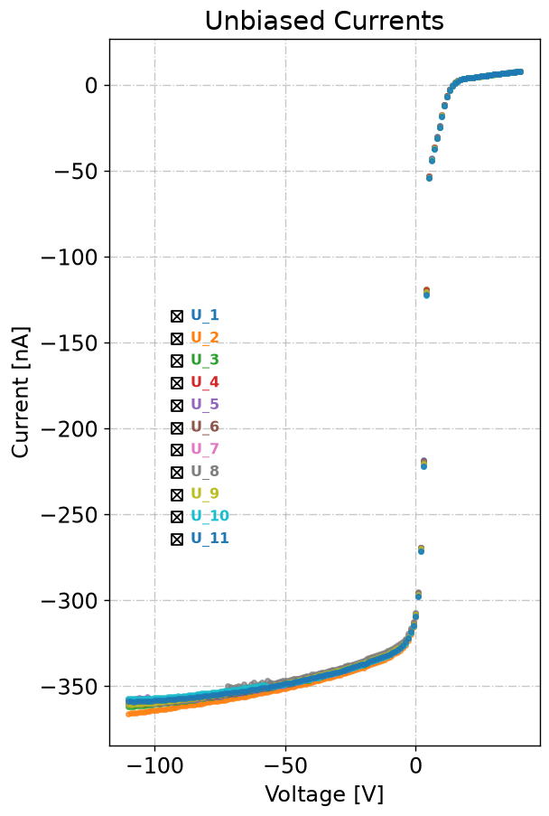

**Fig. 1** All sweeps active.

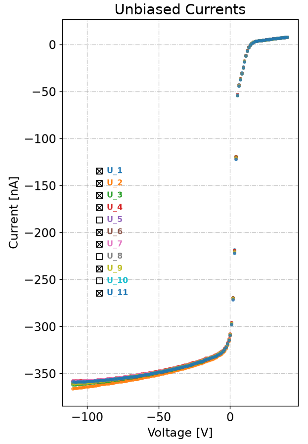

**Fig. 2** Sweeps 5, 8, and 10 deactivated by unchecking their boxes. 
- **Export & Comparison**: Generates analysis output plots (PDF format) and evaluates comparatives across varying experimental parameters (such as pressure or RF power).

## Configuration

Analysis parameters, experimental constants, and plot options are configured inside `config.txt`.

| Key | Default / Example | Description |
| :--- | :--- | :--- |
| DATA_DRIVE_URL | Google Drive URL | Remote directory link for dataset download |
| METHOD | 'scaling' | Baseline reconstruction algorithm ('scaling' or 'shifting')|
| VOLTAGE_START |-110 | Minimum collector sweep voltage (V) |
| VOLTAGE_STOP | 40 | Maximum collector sweep voltage (V) |
| V_MIN, V_MAX | -90, -70 | Voltage interval for the shift baseline method (V) |
| SCALING_V_MIN, SCALING_V_MAX | -90, -70 | Voltage interval for the scale baseline method (V) |
| ION_MASS | 1875E6 | Deuterium Mass used for flux calculations (eV/c²) |
| CROSS_SECTION | 4.43E-20 | Cross section for the collisional detachment reaction (see [State Of The Art](#state-of-the-art)), used for pressure attenuation (m²) |
| POWERS, PRESSURES | [200, 300, 400, 600], [] | Experimental control parameter values used to compare datasets (only one of the two should be non-empty) |
| EXCLUDED_FOLDERS | [] | Folder names to skip during dataset discovery, e.g. output or documentation folders |
| PLOT_RATIO | True | Whether to generate the biased-to-unbiased ratio diagnostic plot (`ratio.pdf`, see `sm.plot_ratio()`) |
| PLOT_DERIVATIVE | True | Whether to generate the unbiased-current derivative / plasma-potential plot (`derivative_unbiased.pdf`, see `sm.derivative_unbiased()`) |
| METHOD_COMPARISON | True | Whether to generate the shift-vs-scale method comparison plot (`ni_shift_vs_scale.pdf`, see `sm.plot_ni_comparison()`) |
| MEASUREMENTS_FOLDER | 'measurements' | Name of the folder (relative to the repository root) that holds the dataset subfolders to analyse |
| RESULTS_FOLDER | 'results' | Name of the folder (relative to the repository root) where all output plots are saved, always kept separate from `MEASUREMENTS_FOLDER` |

The minimum value of `VOLTAGE_START` is actually -120V. However, the corresponding current values may be affected by time transient artifacts owing to the start of the scan.
The remaining keys (plot styling, MRFEA geometry constants, file-loading options) are documented directly as comments inside `config.txt`.

## Examples

### DataLoader

This class finds data within the directory and automatically discards corrupted `.dat` files. However, it may occur that the output file of an MRFEA scan stores neither voltage nor current values. In this instance, calling `dataloader._safe_load('path/to/the/file.dat')` prints:
```python
UserWarning: genfromtxt: Empty input file: "4Pa/biased/MRFEA_2026-02-25_007.dat"
ERROR: failed to load MRFEA_2026-02-25_007.dat: index 1 is out of bounds for axis 0 with size 0
MRFEA_2026-02-25_007.dat skipped.
```
Python is simply signaling that `numpy.genfromtxt()` has not been able to find any columns. Therefore, these measurements do not stop the analysis and are correctly excluded.

### StandardMethod methods

The `StandardMethod` class provides the main analysis steps for processing and interpreting MRFEA measurements. Its methods are organized into four stages: data cleaning, physics and baseline diagnostics, negative-ion current extraction, and statistical verification. For the physical meaning behind each formula used below, see [State Of The Art](#state-of-the-art).

The typical workflow is:

```python
from standardmethod import StandardMethod

sm = StandardMethod(
    loader.voltage,
    unbiased_raw,
    biased_raw,
    loader.results_path,
    style,
    config
)
```

* **1. Data cleaning**

```python
sm.create_plot()
```
Displays the raw I-V characteristics of all acquisitions using an interactive GUI. The checkboxes allow the user to identify and disable corrupted or noisy traces, for example those affected by plasma fluctuations or acquisition problems. As already explained, the selected traces are then excluded from the subsequent analysis. 

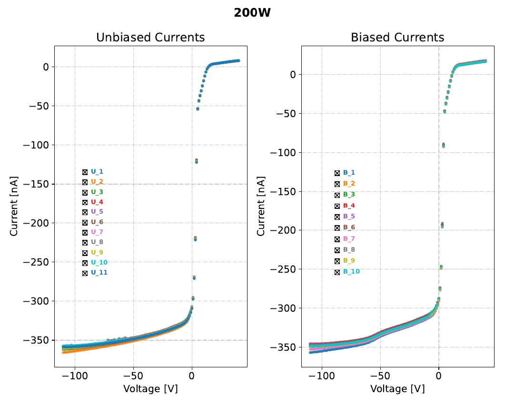

**Fig. 3.** `I-V-characteristic.pdf` (2 Pa - 200 W) Biased acquisitions show a clearly distinguishable NI step above -60 V.


* **2. Baseline reconstruction**

The shift method is a vertical rigid translation of the unbiased trace I_u, which approximates the zero-negative ion baseline. It is implemented in the `StandardMethod` class as follows:

```python
sm.shift_curve(cur_unbiased, cur_biased, V_min, V_max)
```

where V_min and V_max define the voltage window over which the unbiased and biased currents are matched.

The second reconstruction procedure is the scaling method. Experimentally, the electron densities are the only plasma parameters which vary between the two operating sample polarization states. The ratio

$$\frac{N_e^b}{N_e^u}$$

is a measure of the discrepancy between I_b and I_u, as the two currents are determined by the PI flux relation [Eq. (1)](#eq-piflux).

Aiming to assess the validity of the scale method, if `PLOT_RATIO` is `True`, the software calls the method `sm.plot_ratio()`, which plots the average ratio

$$\frac{I_{\text{biased}}}{I_{\text{unbiased}}}$$

as a function of collector voltage. In the voltage region where negative ions are not expected to contribute, the average ratio should be approximately constant.

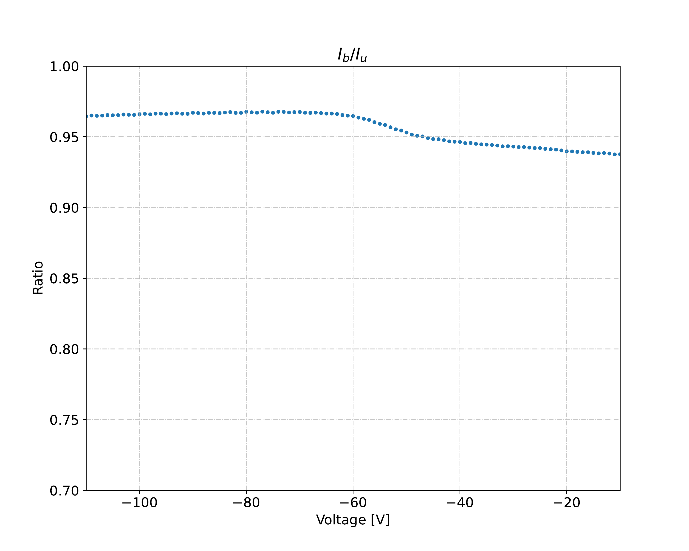

**Fig. 4.** `ratio.pdf` (2 Pa - 200 W)

```python
sm.scale_curve(cur_unbiased, cur_biased, V_min, V_max)
```

applies the average biased-to-unbiased ratio to the unbiased trace, producing the scaled baseline used to extract the negative-ion current.

Important: both the shift and scale methods are already implemented, and the user only needs to state their preference in the configuration file.

* **3. Plasma potential**

If `PLOT_DERIVATIVE` is `True`:

```python
sm.derivative_unbiased()
```

Calculates and plots the first derivative of the unbiased current characteristic,

$$\frac{dI_u}{dV}$$

using Savitzky-Golay filtering. The resulting derivative represents the Positive Ion Energy Distribution Function (PIEDF) and is used to identify the plasma potential V_p ≈ 3.4 V. Regarding the MRFEA, when the collector is polarised at approximately V_p, all the PI are repelled and only negative particles are detected (electrons and NI).

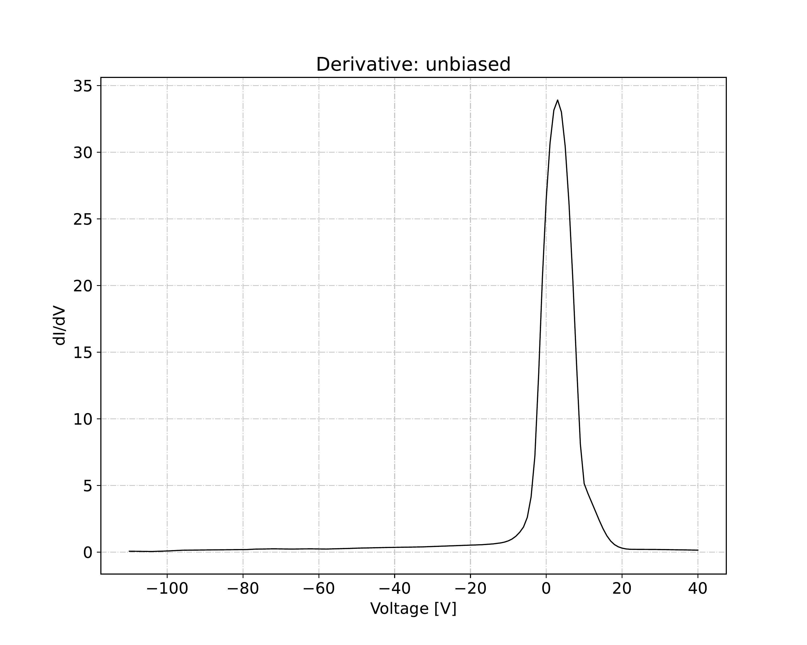

**Fig. 5.** `derivative_unbiased.pdf` (2 Pa - 200 W)

* **4. Negative ion extraction**

```python
sm.negative_collector()
```

Extracts the negative-ion current at a negative collector bias (nominally -40 V). This is the main negative-ion value used for quantitative comparisons between different experimental conditions, such as RF power or pressure scans.

```python
sm.positive_collector()
```

Evaluates the collector current at a positive collector bias (nominally +20 V). This measurement provides a complementary diagnostic and is used to characterise the positive-bias response of the MRFEA.

* **5. Statistical analysis**

```python
sm.variabilities()
```

Evaluates the statistical variability of the measurements across the multiple acquisitions. The method characterises the dispersion distribution of the extracted negative ion currents and the stability of the reconstructed baselines. The Gaussian fits provides an indication of measurement repeatability and acquisition quality. Here are two returned plots:
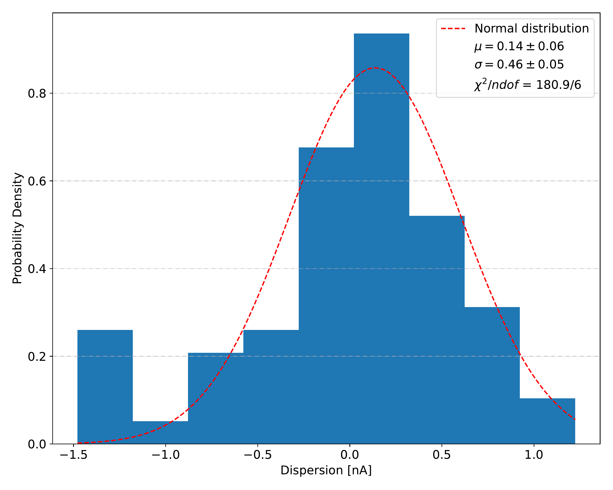

**Fig. 6.** `distribution_NI_40V_shift.pdf` (2 Pa - 200 W)

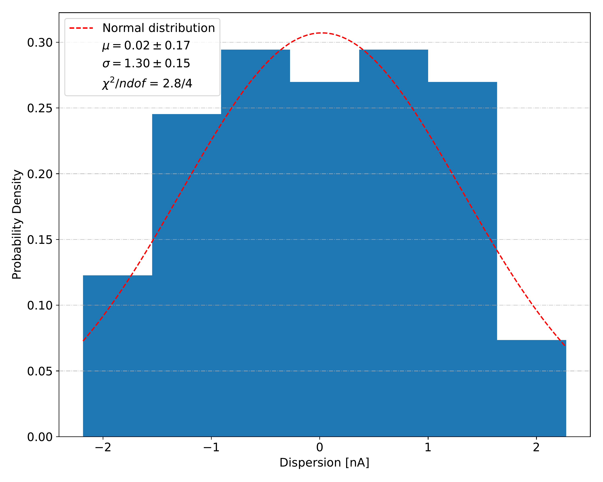

**Fig. 7.** `distribution_slope_40V_scale.pdf` (2 Pa - 200 W)

* **6. Comparison shift vs scale method**

If `METHOD_COMPARISON` is `True`, the method

```python
sm.plot_ni_comparison()
```

compares the negative-ion current obtained using the two available baseline reconstruction methods: shifting and scaling. This allows the user to assess how sensitive the extracted negative-ion signal is to the choice of baseline method.

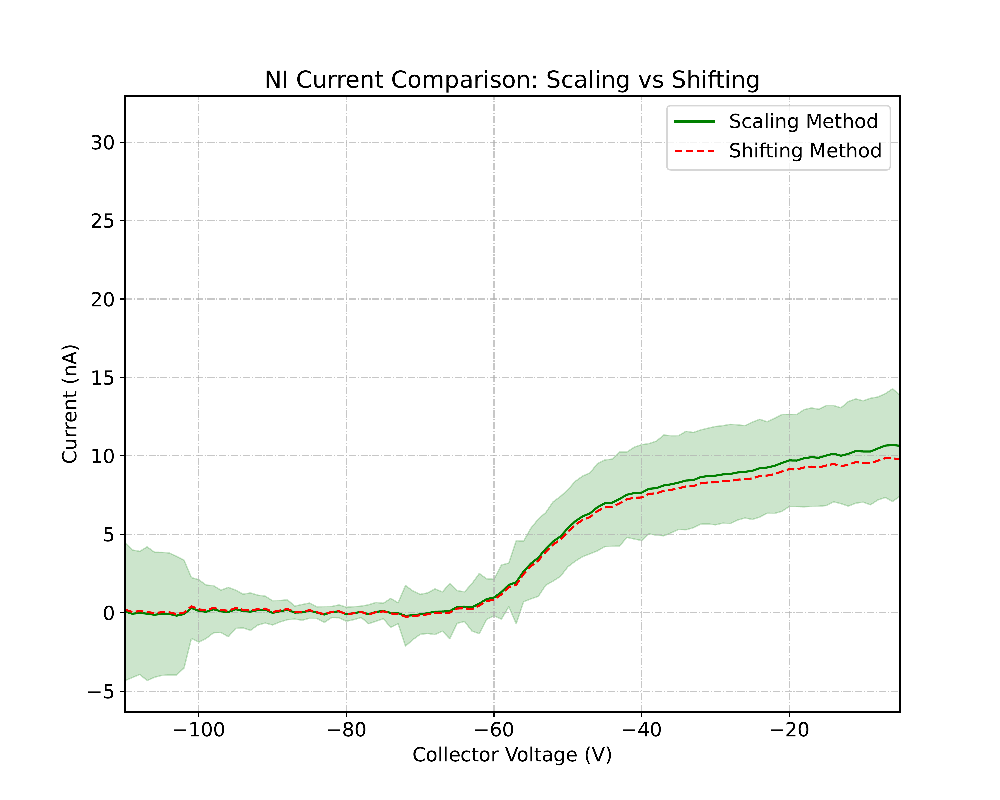

**Fig. 8.** `ni_shift_vs_scale.pdf` (2 Pa - 200 W)

For those who want to edit the code as needed: this method must always be called after `sm.negative_collector()`.

### Single dataset, no comparison

If `unbiased/` and `biased/` are found directly inside `measurements/`, the tool offers to analyse just that one dataset:

```
project/
├── main.py
├── config.txt
└── measurements/
    ├── unbiased/
    │   ├── acq_001.dat
    │   └── ...
    └── biased/
        ├── acq_001.dat
        └── ...
```

```sh
$ python main.py
...
Unbiased and Biased directories found in the main folder
Do you want to analyse them? [y/n]
y

Analysis of a single data set:
No comparison will be done
```

This produces, in `results/single/` (or `results/<condition-name>/` when analysing one folder among several):
- `I-V-characteristic.pdf` — raw unbiased/biased traces with the interactive checkboxes used to discard bad acquisitions
- `ratio.pdf` — the biased-to-unbiased ratio diagnostic for the scale method (optional, see `PLOT_RATIO`)
- `derivative_unbiased.pdf` — the derivative of the unbiased current (PIEDF), used to locate the plasma potential (optional, see `PLOT_DERIVATIVE`)
- `ni_step.pdf` — negative ion current vs voltage, after baseline subtraction
- `dist_func.pdf` — the negative ion energy distribution function (dn_i/dV)
- `ni_shift_vs_scale.pdf` — comparison between the shift and scale baseline reconstructions (optional, see `METHOD_COMPARISON`)
- `distribution_NI_40V_shift.pdf`, `distribution_NI_40V_scale.pdf`, `distribution_slope_40V_shift.pdf`, `distribution_slope_40V_scale.pdf`, `distribution_NI_pc.pdf` — Gaussian dispersion fits produced by `variabilities()`
- `comparison_slope_distribution.pdf` — histogram comparing the -40V slope estimates between the shift and scale methods
- `dispersion_ni.txt` — the numerical dispersion values underlying the Gaussian fits above

plus a console summary of the negative- and positive-collector NI currents (`_print_collector_summary`).

Some of these, from a real power-scan run:


#### Negative Ion Current

The characteristic NI current, plotted against collector voltage, obtained by applying the scaling method.

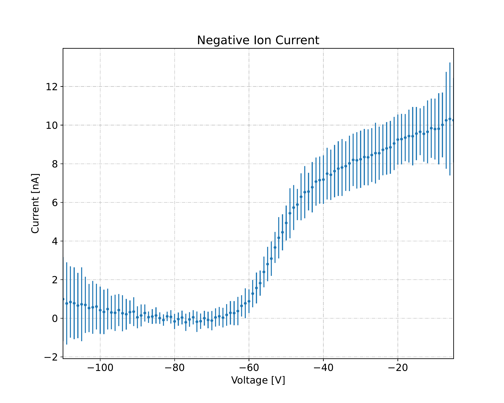

**Fig. 9.** `ni_step.pdf` (2 Pa - 200 W)


#### NIEDF Plot

The negative ion energy distribution function, dn_i/dV, obtained as the voltage derivative of the NI current shown above.

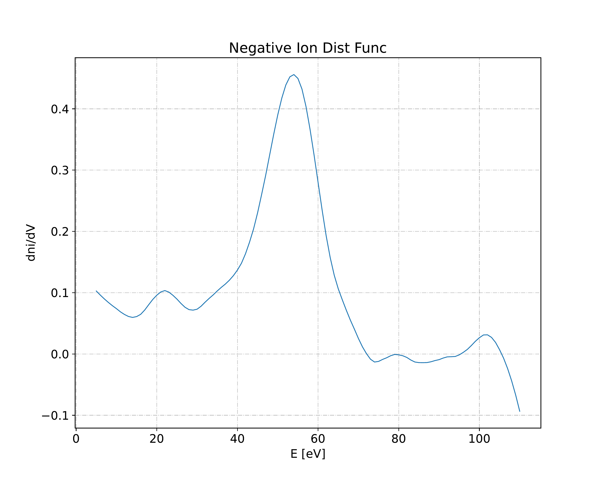

**Fig. 10.** `dist_func.pdf` (2 Pa - 200 W)


### Comparing several experimental conditions

To compare, e.g., an RF power scan, put each condition in its own folder inside `measurements/` (each containing its own `unbiased/`/`biased/`) and list the values under `POWERS` in `config.txt`:

```
project/
├── config.txt
└── measurements/
    ├── 200W/{unbiased,biased}/
    ├── 300W/{unbiased,biased}/
    ├── 400W/{unbiased,biased}/
    └── 600W/{unbiased,biased}/
```

```
# config.txt
POWERS = [200, 300, 400, 600]
PRESSURES = []
```

Running `python main.py` now analyses every folder individually, saving each condition's plots in its own `results/200W/`, `results/300W/`, etc. (same file list as above), and additionally produces comparison plots in `results/comparisons/`:
- `comparison_ni_curr.pdf` — NI current curves of all conditions overlaid
- `comparison_energy_distribution.pdf` — NIEDF of all conditions overlaid
- `comparison_minus_40V_plus_20V.pdf` — negative/positive collector current vs Power (or Pressure)
- `comparison_NI_curr_vs_pi_flux_power.pdf` — NI current vs positive ion flux, only generated when `ELECTRON_DENSITIES`/`ELECTRON_TEMPERATURES` are also configured (named `..._pressure.pdf` for a pressure scan)

The same workflow applies to a pressure scan by filling `PRESSURES` instead of `POWERS` (only one of the two should be non-empty). 

Here are some plots from a real 4-point power scan (200 to 600 W):

#### NI Current & NIEDF Comparison

Figs. 11 and 12 show the NI currents and energy distributions for the scanned powers. It is evident that the negative-ion density depends on the injected power, while their energy is unaffected: the energy of surface-produced NI depends only on the sample bias.

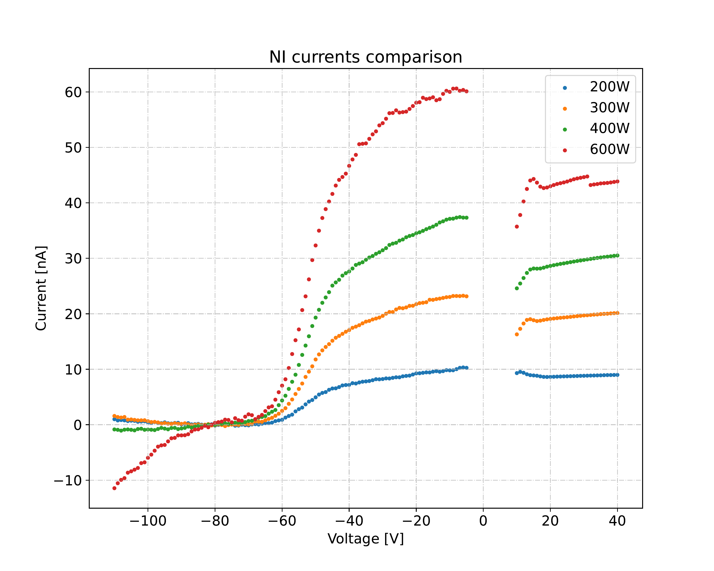

**Fig. 11.** `comparison_ni_curr.pdf`

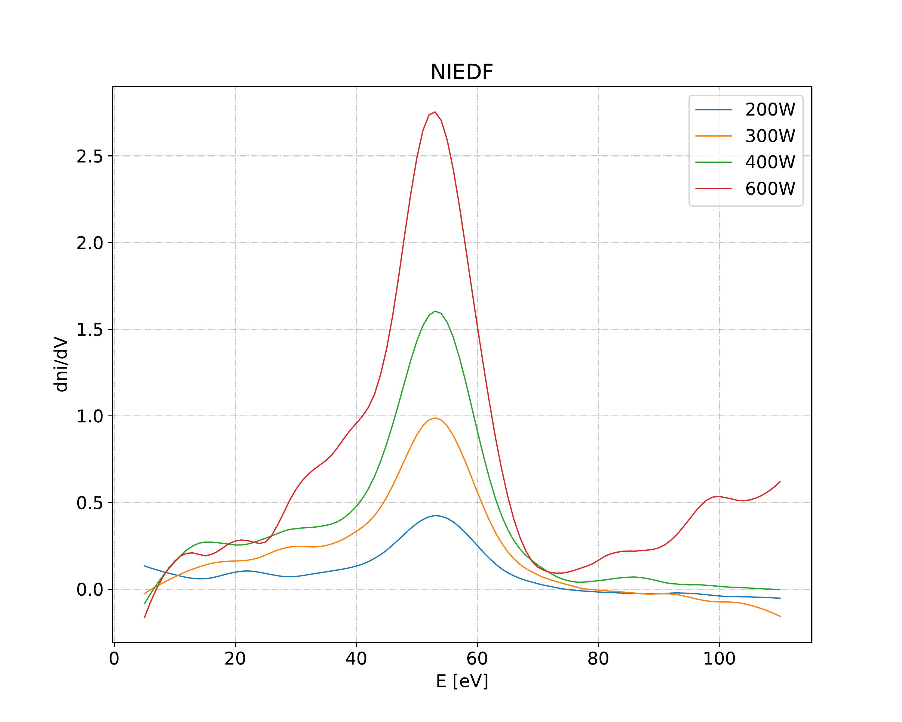

**Fig. 12.** `comparison_energy_distribution.pdf`

#### NI Current: -40V vs +20V

This figure directly compares the NI current measured at the two collector voltages, which turn out to be compatible with each other within experimental error. It also shows that the NI current increases linearly with the injected power.

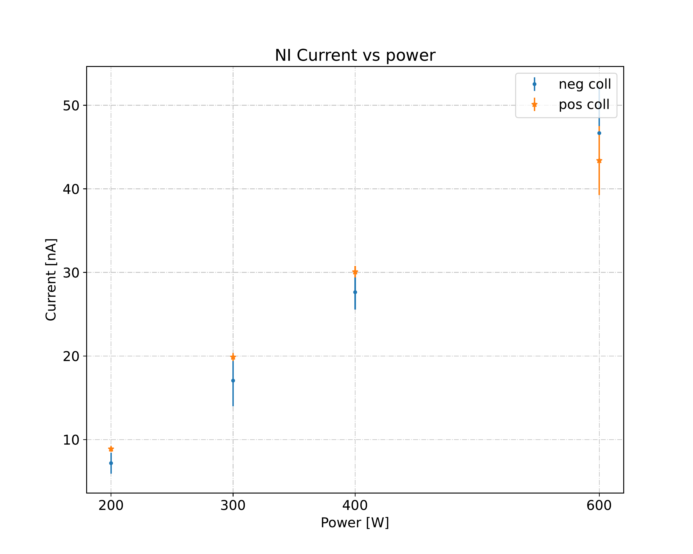

**Fig. 13.** `comparison_minus_40V_plus_20V.pdf`

#### NI Current vs PI Flux

This plot shows the collected NI current against the PI flux at the analyzer collector: the more PI impinge on the sample surface, the more NI are produced.

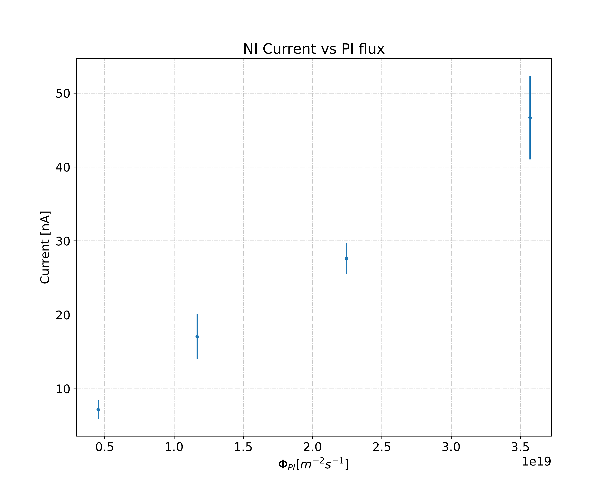

**Fig. 14.** `comparison_NI_curr_vs_pi_flux_power.pdf`

### Choosing the baseline reconstruction method

```
# Shift method: constant offset fitted over [V_MIN, V_MAX]
METHOD = 'shifting'
V_MIN = -90
V_MAX = -70
```

```
# Scale method: multiplicative ratio fitted over [SCALING_V_MIN, SCALING_V_MAX]
METHOD = 'scaling'
SCALING_V_MIN = -90
SCALING_V_MAX = -70
```

### Excluding folders from the scan

Any folder name listed here is skipped while scanning `measurements/`, without being asked about interactively:

```
EXCLUDED_FOLDERS = [old_run_2024, calibration]
```

### Fetching data automatically from Google Drive

If no valid dataset folder is found locally and `DATA_DRIVE_URL` points to a shared Google Drive folder, the tool downloads it before analysis starts:

```
# config.txt
DATA_DRIVE_URL = https://drive.google.com/drive/folders/<folder_id>
```

```sh
$ python main.py

No local dataset found. Downloading data from Google Drive...

Download completed successfully!
```

## Modules

| Module | Responsibility |
| :--- | :--- |
| `main.py` | Entry point: dataset discovery, Google Drive retrieval trigger, and the overall workflow. |
| `modules/functions.py` | Computation and plotting helpers, plus the orchestration functions (`compute_dataset`, `analysis`, `comparison`, `process_folders`) that `main.py` calls. |
| `modules/style.py` | `PlotStyle`, the styling parameters (figure size, font, line/marker style, grid) shared by every plot. |
| `modules/standardmethod.py` | Core analysis pipeline: baseline reconstruction (shift/scale methods), negative/positive collector currents, NIEDF, and statistical variability, including the interactive checkbox validation. |
| `modules/dataloader.py` | Discovery and validation of the raw `.dat` acquisition files, construction of the voltage vector, and resolution of each dataset's `measurements/`/`results/` paths. |
| `modules/configreader.py` | Parser for the `key=value` configuration file format used by `config.txt`. |
| `modules/downloader.py` | `GoogleDriveDownloader`, used to fetch missing dataset folders from Google Drive via `gdown`. |

`main.py` is the only file meant to be run directly; everything else lives in `modules/`, importable as `modules.<name>`.

Every module, class, and function is documented following the [Doxygen](https://www.doxygen.nl/) convention (`## @brief` / `@param` / `@return` comment blocks). A browsable HTML reference can be generated from the included `Doxyfile`:

```sh
doxygen Doxyfile
```

The output is written to `html/index.html` (not versioned; regenerate it locally whenever needed).


